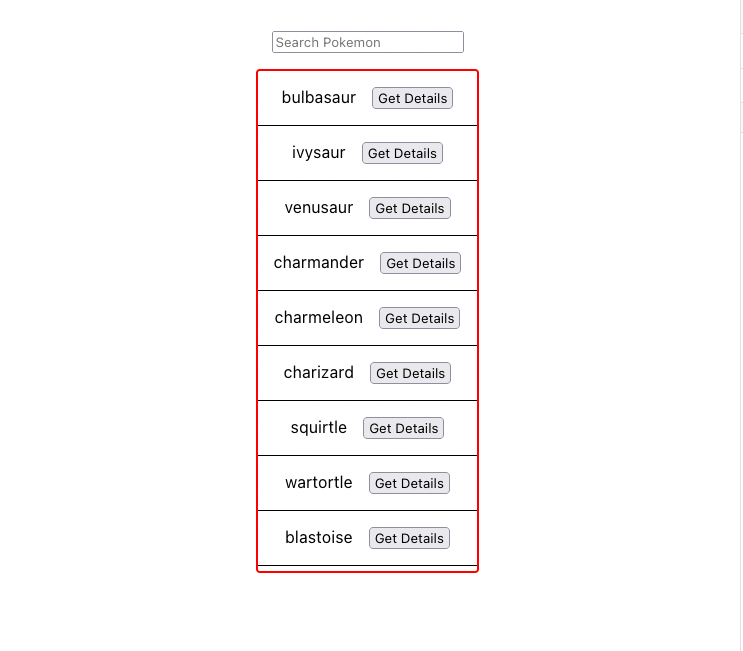

## Requirements

### Search
- ✅ Typing in the search input should filter the existing Pokemon list and render only matches found
- ✅ Fix any bugs that prevent the search functionality from working correctly
- ✅ If there are no results from search, render "No Results Found"
- ✅ The search results container should be scrollable
- ✅ The UI should match the below mockup

### Details Card
     
- ✅ Clicking "Get Details" for any given Pokemon should render a card that has the Pokemon's `name`, `types`, `moves`, and `evolution chain`
- ✅ Use the api functions defined in `api.js` to retrieve this data. Adding new endpoints or editing existing ones are out of scope
- ✅ The details card should match the below mockup

## Follow-up Questions

Please take some time to answer the following questions. Your answers should go directly in this `readme`.

- Given more time, what would you suggest for improving the performance of this app?

- Is there anything you would consider doing if we were to go live with this app?

- What was the most challenging aspect of this work for you (if at all)?